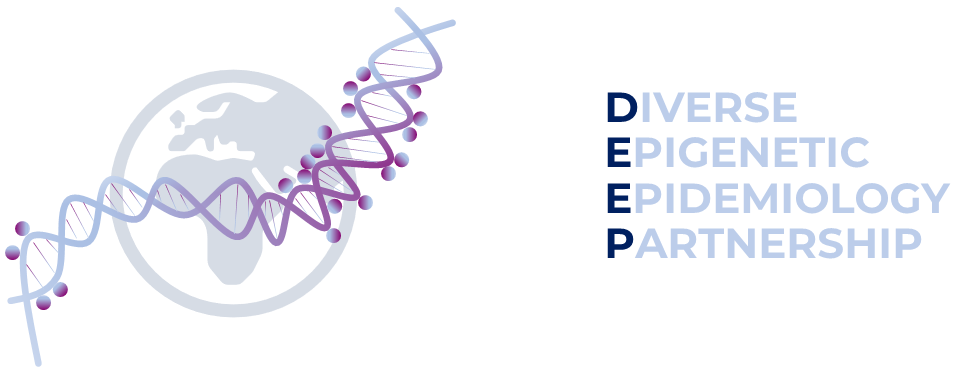

## Welcome to DEEP pipeline.

Here we need to modify the GoDMC phase 2 pipeline for DEEP aims.
In the following context, Haotian listed his action points for the pipeline.

change 2a for DEEP for multi-ancestry, imputation reference 

Hase from python 2 to python 3? 
Hase for interaction analysis

## 1. Variants list
We need a list of variants for SNP harmonisation purposes in script02a. We want to update the HRC list with H3Africa, if available.
Other resources: the [African Genome Variation Project (AGVP)](https://www.sanger.ac.uk/collaboration/african-genome-variation-project/) (mentioned in pan-UKB),TopMed, HGDP, and Hapmap3.

TopMed freeze8 snp list was liftovered from GRCh38 to GRCh37. There are SNPs being mismatched with another chromosome, e.g. SNPs on chr22 can be mismatched on chr21, during LiftOver. I tried three methods here ([genehackman](https://github.com/MRCIEU/GeneHackman), [genepi.utils](https://github.com/nicksunderland/genepi.utils) and [my script](https://github.com/Haotian2020/PAR1_MRdrugtarget_Project/blob/main/scripts/fn-perform_liftover.R)), all have this mismatch issue. I manually and randomly picked some mismatched SNPs from chr1, 2 and 22. I found most of the mismatched cases is due to there is no information of GRCh37 (showing as chr:-1 on dbSNP). Very little situation is that dbSNP has both GRCh37 and GRCh38 information, which means chain files failed to match it. So, I finally just decided to simply remove these mismatched SNPs. I used rentrez R package to extract GRCh37 and GRCh38 position information, to compare if matched SNPs have the consistent position with dbSNP database does, by randomly picking 1000 SNPs on each chromosome (dbSNP API is really slow, which didnt allow you to run 23 chromosomes in the same time with one API key).

TopMed list was merged with HRC r1-1 list (original from GoDMC2 piepline). The duplicated chr:pos_A1_A2 was removed.

TopMed Variants list now has been created and uploaded to DEEP RDSF project, named topmed.GRCh38.f8wgs.pass.nodup.mac5.maf001.tab.snplist.gz.

## 2. Pipeline release (not now)
I asked Gib and Tom about the question whether I should use environment files (.yaml / .yml) or use a docker for any pipeline.  
Gib had released both an environment file and a Docker file for [lifecourse-gwas](https://github.com/mrcieu/lifecourse-gwas). 
Tom raised a good point that using docker requires the root right, some HPC systems do not allow users to run jobs through dockers. 
Based on these Information, I would like to choose environment files first and when the DEEP pipeline is finished, then I can make an docker file.  Yi also agree with the point that using docker need the admin right of HPC, which is less achieviable compared with using conda envoriment.
Let me try to make a docker anyway.
99% senerio conda/mamba should be enough and 1% for using docker.

## 3. How to define/assign individuals to a genetic ancestry in a population/cohort?
In pan-UKB ([medRxiv paper](https://doi.org/10.1101/2024.03.13.24303864)), they compared two different methods, including meta-analyzing genetic ancestry group and mega-analyzing all individuals. 
They concluded that using the meta-analyzing method results in less evidence of cryptic stratification, reducing false positives and improving the robustness of associations.

pan-UKB applied principal components analysis (PCA) on a diverse reference panel consisting of the Human Genome Diversity Panel (HGDP) and 1000 Genomes Project genotype data, 
to assign each inidividual to a genetic ancestry group. 
The ancestry labels provided by HGDP+1kGP includes: EUR (European), CSA (Central/South Asian), AFR (African), EAS (East Asian), MID (Middle Eastern), and AMR (Admixed American - an imprecise label introduced by the 1kGP to describe individuals with recent admixture from
multiple continents including Amerindigenous ancestry). All of US applied the same reference panel as described in pan-UKB. 

which part of Africa, e.g. West, east and south ; TopMed and H3 Africa. AGVP contains 18 African populations, including 2 populations from the 1000 Genomes Project.

| Project  | Super_pop | Description                             | Sample_size | Which part of Africa |
|----------|-----------|-----------------------------------------|-------------|----------------------|
| 1KG_p3   | AFR       | African Ancestry in Southwest US        | 66          | /                    |
|          |           | African Caribbean in Barbados           | 96          |                      |
|          |           | Esan in Nigeria                         | 99          |                      |
|          |           | Gambian in Western Division, The Gambia | 113         |                      |
|          |           | Luhya in Webuye, Kenya                  | 116         |                      |
|          |           | Mende in Sierra Leone                   | 85          |                      |
|          |           | Yoruba in Ibadan, Nigeria               | 109         |                      |
| H3Africa | AFR       | Algeria                                 | 28          |                      |
|          |           | Benin                                   | 50          |                      |
|          |           | Botswana                                | 54          |                      |
|          |           | Burkina Faso                            | 33          |                      |
|          |           | Cameroon                                | 50          |                      |
|          |           | Central African Republic                | 26          |                      |
|          |           | DRC                                     | 13          |                      |
|          |           | Egypt                                   | 10          |                      |
|          |           | Gambia                                  | 115         |                      |
|          |           | Ghana                                   | 26          |                      |
|          |           | Guinea                                  | 20          |                      |
|          |           | Kenya                                   | 108         |                      |
|          |           | Mali                                    | 50          |                      |
|          |           | Namibia                                 | 7           |                      |
|          |           | Nigeria                                 | 727         |                      |
|          |           | Senegal                                 | 2           |                      |
|          |           | Sierra Leone                            | 87          |                      |
|          |           | South Africa                            | 271         |                      |
|          |           | Sudan                                   | 2           |                      |
|          |           | Tanzania                                | 10          |                      |
|          |           | Western Sahara                          | 2           |                      |
|          |           | Zambia                                  | 41          |                      |
| AGVP     | AFR       | Baganda                                 | 97          |                      |
|          |           | Banyarwanda                             | 95          |                      |
|          |           | Barundi                                 | 91          |                      |
|          |           | Ethiopia                                | 107         |                      |
|          |           | Fula                                    | 74          |                      |
|          |           | Ga-Adangbe                              | 100         |                      |
|          |           | Igbo                                    | 99          |                      |
|          |           | Jola                                    | 79          |                      |
|          |           | Kalenjin                                | 100         |                      |
|          |           | Kikuyu                                  | 99          |                      |
|          |           | Mandinka                                | 87          |                      |
|          |           | Sotho                                   | 86          |                      |
|          |           | Wolof                                   | 78          |                      |
|          |           | Zulu                                    | 100         |                      |
| HapMap3  | AFR       | African ancestry in Southwest USA       | 90          | /                    |
|          |           | Luhya in Webuye, Kenya                  | 100         |                      |
|          |           | Maasai in Kinyawa, Kenya                | 180         |                      |
|          |           | Yoruba in Ibadan, Nigeria               | 180         |                      |
|          |           |                                         |             |                      |
|          |           |                                         |             |                      |

## 4. Meta analysis (not now)
We use HASE for our mQTL analyses as the standard molecular QTL mapping methods implemented in matrixeQTL, tensorQTL, OSCA etc. can’t store all the summary statistics. 
[HASE](https://pubmed.ncbi.nlm.nih.gov/27782180/) doesn’t calculate summary statistics for each cohort followed by meta-analysis it stores partial derivatives.

There is a meta-analysis script [here](https://github.com/genetics-of-dna-methylation-consortium/mqtl_meta_analysis) 
but Josine need to discuss with Xiaopu first as Xiaopu was planning to implement this for GoDMC. Olalekan has tried to update HASE to python3 but we didn’t manage to finish it.

## 5. Interaction mQTLs (not now)
[paper](https://www.sciencedirect.com/science/article/pii/S0002929723004317)
Y = β0 + βSNP × SNP + βEnv × Environment + βinter × (SNP × Environment) + ϵ

where Y is the molecular phenotype (DNAm level; normalized), G is the genotype of the genetic variant with MAF > 0.01 (we have a snplist that MAF >= 0.01) in the DEEP cohort, E is the environmental variable (estimated cell-type proportions, age, sex, smoking phenotype; mean-centered), G × E is the interaction effect between the genotype and environmental variable, and C represents additional covariates that correspond to 10 genotype PCs from previous steps.

imQTLs with a nominally significant genotype main effect (PSNP < 0.05) were assigned to the “positive” or “negative” group if the product of the genotype main effect and interaction effect (βSNP × βinter) was greater or smaller than 0, respectively.

## README unchanged parts -------------------
This repository contains the scripts to run the GoDMC pipeline which includes:

* Genome-wide scans for DNA methylation quantitative trait loci
* GWAS of DNAm derived phenotypes
* EWAS of genetic phenotypes

Please note the scripts in this repository are copyright of the Genetics of DNA Methylation Consortium and released with a [GPL v3 license](LICENSE).

### What is GoDMC?

The [Diverse Epigenetic Epidemiology Partnership (DEEP)](https://www.deep-epigenetics.org/) is a partnership of 20 research groups from around the world that aims to improve global health by exploring the effects of genomic and environmental diversity on disease risk across the global population.

DEEP study researchers are interested in studying the differences in disease mechanism and disease risk prediction that are associated with DNA methylation. DNA methylation refers to modifications to DNA which help in turning genes on or off (transcription).The DEEP study ultimately aims to identify disease mechanisms and drug targets that work for all.

To give you an idea of the kind of analyses we are interested please review our previous publication: https://pubmed.ncbi.nlm.nih.gov/34493871/.

If you are interested in joining or finding out more please contact either Josine Min (Josine.Min@bristol.ac.uk) or Eilis Hannon (E.J.Hannon@exeter.ac.uk)

## Guidance for how to use this repository

Detailed instructions for running each stage of the pipeline [can be found here](https://github.com/genetics-of-dna-methylation-consortium/godmc_phase2/wiki). This includes details on how what software you need to have installed, and the required input data and their format. 

Whilst we have done a lot of testing of these scripts across a range of different datasets, we do anticipate that there will be bugs and edge cases we are yet to detect. All communication regarding this pipeline is to occur through this GitHub repository. If you email any of the developers they will direct you back to this repository. 

There are two ways to communicate with us. 

1. [Issues](https://github.com/genetics-of-dna-methylation-consortium/godmc_phase2/issues). This is the mechanism to report bugs or errors with the pipeline or documentation. Essentially anything which requires us to make edits to the content in the repository. There are more guidelines on how to submit issues below.
2. [Discussions](https://github.com/genetics-of-dna-methylation-consortium/godmc_phase2/discussions). This is the place to ask questions about the pipeline and analyses. 

## Submitting an issue

Thank you for helping improve our project! Before you submit an issue, please take a moment to review these guidelines to ensure your issue is addressed effectively.

### General Guidelines
**Search Existing Issues:** Before submitting a new issue, please search the existing issues (including closed issues) to see if your problem has already been reported. This helps avoid duplicates and allows us to focus on a single thread of discussion for each issue.

**Use Clear and Descriptive Titles:** Provide a concise summary of the issue in the title. This helps others understand and search for similar issues.

**Provide Detailed Information:**

**For Bugs**: Specify which script you were running when the error occured, the expected result, and the actual result. Provide any relevant logs or screenshots.

**For Documentation:** Specify the page & section where the documentation was misleading or confusing. 

## Guidance for contributing

The scripts in this repository were developed by the core GoDMC team and individuals who had [approved external projects](http://www.godmc.org.uk/projects.html). A list can be found under the Acknowledgements section below. At present just this group are able to contribute to the pipeline - if you are interested in joining this group please contact either Josine Min (Josine.Min@bristol.ac.uk) or Eilis Hannon (E.J.Hannon@exeter.ac.uk).

## Acknowledgements

The developer group of these scripts are listed in alphabetical order below:

Carlos Ruiz Arenas  
Eilis Hannon  
Gibran Hemani  
Haotian Tang  
Josine Min  
Maria Soler Artigas  
Natalia Llonga  
Olalekan Awoniran  
Olivia Castellini  
Siyi Wang  
Sonja Rajic  
Thomas Jonkman  
Xiaopu Zhang  